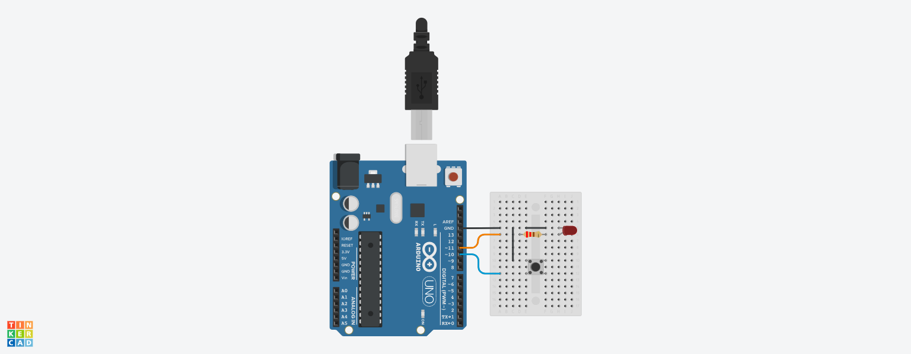

# Controlling an LED with Arduino & Node.js
<!-- Arduino & Arduino IDE -->
## Arduino & Arduino IDE
[***Arduino***](https://www.arduino.cc/) is an open-source electronics platform that consists of both hardware and software components. Arduino includes a series of microcontroller boards that are equipped with various input and output pins. The [*Arduino IDE*](https://www.arduino.cc/en/software/) is a programming environment used to write, compile, and upload code to the Arduino board. It uses a programming language based on C/C++ to write sketches. Arduino *Sketches* are the program files with the `.ino` extension that contain Arduino code. These files define the behavior of the Arduino board when it is running.
<!-- Tinkercad -->
[***Tinkercad***](https://www.tinkercad.com/) is an online platform that allows users to design and simulate 3D models. Tinkercad can be used to program and simulate a virtual Arduino microcontroller circuit online. Tinkercad includes a circuit simulation feature that allows users to design and simulate electronic circuits.

## Controlling an LED with Arduino

### Build the Circuit

Build the circuit shown using an Arduino board, a breadboard, an LED, a 220Ω resistor, a pushbutton and some jumper wires.

#### Using Tinkercad:
- If using Tinkercad, click on "Create" and select "Circuit" from the drop-down menu.
- This will open a new workspace so that you can drag-and-drop the components needed.



### Creating a Sketch
Open the Arduino IDE and insert the code that is shown to a new sketch.

#### Using Tinkercad:
- If using Tinkercad, click on "Code" button on the top right area of the screen.
- Change the Edit Mode from "Blocks" to "Text" by clicking on the selector. This lets you write raw Arduino code instead of using visual drag-and-drop blocks.

```ino
/* ledToggle.ino */
const int ledPin = 11;
const int buttonPin = 10;

int ledState = LOW;
int currentState, lastState;

void setup() {
    pinMode(ledPin, OUTPUT);
    pinMode(buttonPin, INPUT_PULLUP);

    currentState = digitalRead(buttonPin);
    lastState = currentState;
}
void loop() {
    lastState = currentState;
    currentState = digitalRead(buttonPin);

    if (lastState == HIGH && currentState == LOW){
        ledState = !ledState;
        digitalWrite(ledPin, ledState);
    }

    delay(100);
}
```

### Uploading the Sketch to the Board
1. Open the Arduino IDE and connect your Arduino Uno board to the USB port.
2. Go to **Tools > Board > Arduino Uno** to select the board.
3. Go to **Tools > Port** and select the one labeled *COM# (Arduino Uno)*
4. Go to **Sketch > Verify/Compile** or click the checkmark button to compile the sketch.
5. If there are any errors, review the code, fix the errors and compile the code again.
6. Go to **Sketch > Upload** or click the arrow button to upload the sketch.
#### Using Tinkercad:
- If using Tinkercad, click on *"Start Simulation"* button on the top right area of the screen.
- If the code has any errors, the code will not run and the errors will be highlighted in red.

## VS Code & Node.js
[***Visual Studio Code***](https://code.visualstudio.com/) is a source-code editor made by Microsoft. PowerShell is a task-based command-line shell and scripting language created by Microsoft that is available in the VS Code editor. For this project, we will be using VS Code with Node.js installed on the computer. When you open VS Code, it displays a code editor window, a command terminal and a file explorer.

[***Node.js***](https://nodejs.org/) is an open-source, server-side JavaScript runtime environment built on the Chrome V8 JavaScript engine. Node Package Manager, NPM, comes bundled with the Node.js installation. NPM is a package manager used for managing and distributing open-source JavaScript packages and libraries. An alternative to NPM is Yarn. ***Yarn*** is a package manager developed by Facebook in collaboration with other companies and the open-source community to address some limitations of existing package managers.
<!-- Yarn Package Manager -->
Install Yarn via NPM:
```ps
npm install --global yarn
```
Verify that yarn was installed.
```ps
yarn --version
```
### Johnny-Five & SerialPort
[***Johnny-Five***](https://johnny-five.io/) is an open-source JavaScript framework that allows you to control and interact with various hardware devices using JavaScript. [***SerialPort***](https://serialport.io/) is a JavaScript library that provides a simple and convenient API for serial communication. It allows you to read from and write to serial ports on your computer or embedded devices. These libraries allow you to control the Arduino board from Node.js over USB.

## Controlling an LED with JavaScript using Johnny-Five

Create a new project directory with a JavaScript file in it named "ledToggle.js".
```ps
New-Item -Path .\Project -ItemType Directory
New-Item -Path .\Project\ledToggle.js -ItemType File
```
Navigate into the project directory and initialize a Node.js project.
```ps
cd Project
yarn init -y
```
Adding `--yes` or `-y` to the command bypasses the prompt questions. A *package.json* file will be generated in the Project directory.
If using NPM instead, run `npm init --yes`.

Helpful Terminal Tips:
- `cd..` will return you to a parent directory.
- `cd 'My Project'` will let you enter a directory with a space in the title.
- `cd E:\` switch to another drive like a USB or external disk.

#### Install The Necessary Packages.

- Install the Johnny-Five and SerialPort packages.
```shell
yarn add johnny-five serialport
```
or
```shell
npm install johnny-five serialport
```
This will install the libraries and create the necessary `node_modules/`, `package.json`, and a lock file (`yarn.lock `or `package-lock.json`).

#### Your Project Directory Should Look Like:
```
  Project/
  ├── node_modules/
  ├── ledToggle.js
  ├── package.json
  └── yarn.lock
  or
  └── package-lock.json
```
#### Edit the JavaScript Code.
Open the file ledToggle.js and add the JavaScript code as shown.
```js
/* ledToggle.js */
const { Board, Button, Led } = require('johnny-five');

const board = new Board();

const buttonPin = 10;
const ledPin = 11;
let ledState = false;

board.on('ready', function () {
  const button = new Button({
    pin: buttonPin,
    isPullup: true
  });

  const led = new Led(ledPin);

  button.on('down', () => {
    ledState = !ledState;
    if (ledState) {
      led.on();
    } else {
      led.off();
    }
  });
});

  ```

#### Get the Circuit Ready

Build the circuit as shown in the image using the following components:
- Arduino Uno R3 board  
- Breadboard  
- LED (any color)  
- 220 Ω resistor  
- Pushbutton  
- Jumper wires  

#### Circuit Diagram


---

#### Upload the Firmata Sketch Using the Arduino IDE

The **Firmata** sketch enables your Arduino to receive instructions from JavaScript using the Johnny-Five library.

1. Open the **Arduino IDE** and connect your Arduino Uno board via USB.
2. Go to **File > Examples > Firmata > StandardFirmata** to open the Firmata sketch.
3. Select your board via **Tools > Board > Arduino Uno**.
4. Select your port via **Tools > Port** and choose the one labeled *COM# (Arduino Uno)*.
5. Upload the sketch via **Sketch > Upload** or by clicking the arrow button.

> Once the Firmata sketch is uploaded, you can close the Arduino IDE.

#### Run the Script Using Node.js

Once your Arduino is connected and the **Firmata** sketch is uploaded, you can run your script with Node.js.

```ps
node ledToggle.js
```
If everything is set up correctly, pressing the pushbutton should toggle the LED on and off.

> Use Ctrl + C in the terminal to stop the script at any time.

#### Optional: Create a Shortcut Command

To simplify running your script, edit the scripts section of your package.json file to include a custom command:
```json
{
  "name": "project",
  "version": "1.0.0",
  "main": "index.js",
  "license": "MIT",
  "dependencies": {
    "johnny-five": "^2.1.0",
    "serialport": "^11.0.0"
  },
  "scripts": {
    "toggle": "node ledToggle.js"
  }
}
```
Now you can run the script using one of the following:

```bash
yarn toggle      # if using Yarn
npm run toggle   # if using NPM
npx toggle       # works in some setups with NPM
```
