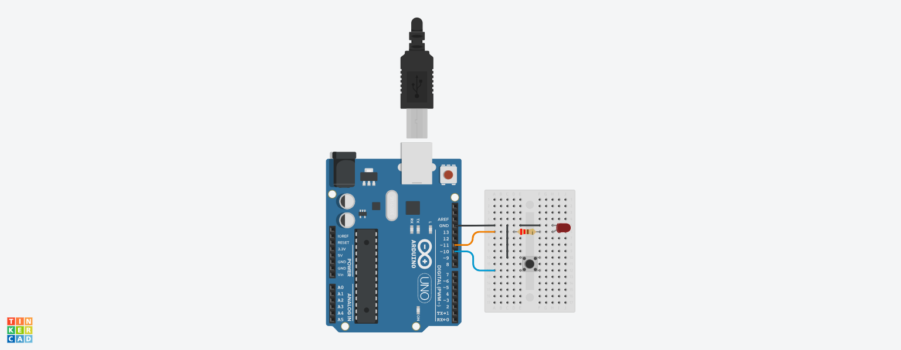

# Controlling an LED with Arduino
<!-- Arduino & Arduino IDE -->
## Arduino & Arduino IDE
[***Arduino***](https://www.arduino.cc/) is an open-source electronics platform that consists of both hardware and software components. Arduino includes a series of microcontroller boards that are equipped with various input and output pins. The [*Arduino IDE*](https://www.arduino.cc/en/software/) is a programming environment used to write, compile, and upload code to the Arduino board. It uses a programming language based on C/C++ to write sketches. Arduino *Sketches* are the program files with the `.ino` extension that contain Arduino code. These files define the behavior of the Arduino board when it is running.
<!-- Tinkercad -->
[***Tinkercad***](https://www.tinkercad.com/) is an online platform that allows users to design and simulate 3D models. Tinkercad can be used to program and simulate a virtual Arduino microcontroller circuit online. Tinkercad includes a circuit simulation feature that allows users to design and simulate electronic circuits.

## Build the Circuit

Build the circuit shown using an Arduino board, a breadboard, an LED, a 220Ω resistor, a pushbutton and some jumper wires.

> ### Using Tinkercad:
> - If using Tinkercad, click on "Create" and select "Circuit" from the drop-down menu.
> - This will open a new workspace so that you can drag-and-drop the components needed.



## Create a Sketch
Open the Arduino IDE and insert the code that is shown to a new sketch.

> ### Using Tinkercad:
> - If using Tinkercad, click on "Code" button on the top right area of the screen.
> - Change the Edit Mode from "Blocks" to "Text" by clicking on the selector. This lets you write raw Arduino code instead of using visual drag-and-drop blocks.

```ino
/* ledToggle.ino */
const int ledPin = 11;
const int buttonPin = 10;

int ledState = LOW;
int currentState, lastState;

void setup() {
    pinMode(ledPin, OUTPUT);
    pinMode(buttonPin, INPUT_PULLUP);

    currentState = digitalRead(buttonPin);
    lastState = currentState;
}
void loop() {
    lastState = currentState;
    currentState = digitalRead(buttonPin);

    if (lastState == HIGH && currentState == LOW){
        ledState = !ledState;
        digitalWrite(ledPin, ledState);
    }

    delay(100);
}
```

## Upload the Sketch to the Board
1. Open the Arduino IDE and connect your Arduino Uno board to the USB port.
2. Go to **Tools > Board > Arduino Uno** to select the board.
3. Go to **Tools > Port** and select the one labeled *COM# (Arduino Uno)*
4. Go to **Sketch > Verify/Compile** or click the checkmark button to compile the sketch.
5. If there are any errors, review the code, fix the errors and compile the code again.
6. Go to **Sketch > Upload** or click the arrow button to upload the sketch.

> ### Using Tinkercad:
> - If using Tinkercad, click on *"Start Simulation"* button on the top right area of the screen.
> - If the code has any errors, the code will not run and the errors will be highlighted in red.
