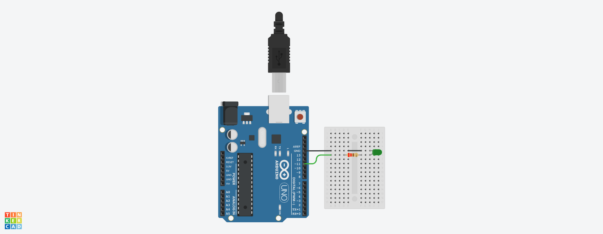

# Controlling an LED with SocketIO
<!-- Express & SocketIO -->
## Express & SocketIO
[***Express***](https://expressjs.com/) is a web application framework for Node.js that simplifies the process of defining routes, handling HTTP requests, managing middleware, and serving static files.

[***Socket.IO***](https://socket.io/) is a JavaScript library that enables real-time, bidirectional communication between web clients and servers. It allows for event-based communication, where the server can send data to connected clients and clients can also send data to the server.

This tutorial shows how to control an Arduino's LED in real-time from a browser using Socket.IO and Johnny-Five with Node.js.

## Set Up Your Project

Make a new project directory file:

```ps
mkdir SocketLED
cd SocketLED
yarn init -y
```
> The `-y` flag automatically accepts all default options for package.json.

Create an HTML file, a CSS file and a JavaScript file in a `public` folder for the front-end.
```ps
New-Item -Path .\public -ItemType Directory
New-Item -Path .\public\index.html -ItemType File
New-Item -Path .\public\style.css -ItemType File
New-Item -Path .\public\code.js -ItemType File
```
Create another JavaScript file in a `server` folder for the back-end.
```ps
New-Item -Path .\server -ItemType Directory
New-Item -Path .\server\server.js -ItemType File
```
Then install the required dependencies:

```bash
yarn add express socket.io johnny-five serialport
```
Or with NPM:

```bash
npm install express socket.io johnny-five serialport
```
After setup, your folder structure should look like this:
```
Project/
├── node_modules/
├── public/
│   ├── code.js
│   ├── index.html
│   └── style.css
├── server/
│   └── server.js
├── package.json
└── yarn.lock
or
└── package-lock.json
 ```
### Set Up the HTML Template
The HTML file will serve as the user interface for controlling an LED from a browser using Socket.IO.

#### Insert Boilerplate Code
1. Open index.html in your code editor.
2. Type `!` and press `Tab` (in VS Code) to generate a full HTML boilerplate.

#### Link Your Stylesheet
Inside the `<head>` tag, under the `<title>`, add:
```html
<link rel="stylesheet" href="style.css">
```
> You can also embed styles directly using `<style> `tags inside the `<head>`.
- To add comments in your CSS use:
```css
/* comment */
```

#### Add the LED Control Interface
Inside the `<body>` tag, insert your LED control button and scripts:
- To add comments in HTML use:
```html
<!-- comment -->
```

Include your JavaScript file, code.js, at the bottom of the body.
```html
<script src="code.js"></script>
```


JavaScript supports both `// single-line` and `/* multi-line */` comments.

Add the Socket.IO client library script before your code runs.
```html
<script src="/socket.io/socket.io.js"></script>
```
#### Final HTML Template
```html
<!DOCTYPE html>
<html lang="en">
<head>
  <meta charset="UTF-8" />
  <meta name="viewport" content="width=device-width, initial-scale=1.0" />
  <title>LED Control</title>

  <!-- Socket.IO Client -->
  <script src="/socket.io/socket.io.js"></script>

  <!-- External CSS -->
  <link rel="stylesheet" href="style.css">

  <style>
    /* Inline CSS styles (optional) */
  </style>
</head>
<body>
  <!-- LED Control UI -->
  <h1>LED Button</h1>
  <button id="buttonLED">LED is OFF</button>

  <!-- External JS -->
  <script src="code.js"></script>

  <script>
    // Inline JavaScript (optional)
  </script>
</body>
</html>
```

#### Add the CSS Style Code
Open the file `style.css` and insert the following code to style the page and button:

```css
/* style.css */
body {
    font-family: Arial, Helvetica, sans-serif;
    font-size: 1rem;
    font-weight: bold;
    background-color: lightgray;
    color: dimgray;
    text-align: center;
}
button {
    background-color: crimson;
    color: azure;
    font-size: inherit;
    font-weight: inherit;
    width: 150px;
    border: solid thin gray;
    border-radius: 0.5rem;
    padding: 3px 30px;
    cursor: pointer;
    transition-duration: 0.5s;
}
```
>You can tweak the colors and spacing to match your preferred style.

#### Add the JavaScript Code
Open the file code.js and insert the following code to add button interactivity:

```js
/* code.js */
const socket = io();
const buttonLED = document.getElementById("buttonLED");
buttonLED.style.backgroundColor = 'crimson';
let isOn = false;
buttonLED.addEventListener("click", function() {
    if (isOn) {
        isOn = false;
        buttonLED.textContent = "LED is OFF";
        buttonLED.style.backgroundColor = 'crimson';
        socket.emit('ledStatus', { isOn:isOn });
    } else {
        isOn = true;
        buttonLED.textContent = "LED is ON";
        buttonLED.style.backgroundColor = 'darkgreen';
        socket.emit('ledStatus', { isOn:isOn });
    }
});
 ```     
The socket sends an event called ledStatus with the current LED state every time the button is clicked.
The server will use this to control the Arduino LED.


#### Add the Server Code
Open the file server.js and insert the following code:
```js
/* server.js */

// Required modules
const express = require('express');
const http = require('http');
const { Server } = require('socket.io');
const path = require('path');
const { Board, Led } = require('johnny-five');

// App setup
const app = express();
const server = http.createServer(app);
const io = new Server(server);
const PORT = 3000;

// Serve static files from the public directory
app.use(express.static(path.join(__dirname, '../public')));

// Fallback route for '/'
app.get('/', (req, res) => {
  res.sendFile(path.join(__dirname, '../public/index.html'));
});

// Arduino board logic
const board = new Board();

board.on('ready', () => {
  console.log('Board is ready!');

  const ledPin = 13;
  const led = new Led(ledPin);

  // Listen for socket connections
  io.on('connection', (socket) => {
    console.log('Client connected');

    socket.on('ledStatus', (data) => {
      console.log('LED Status:', data);
      const { isOn } = data;
      isOn ? led.on() : led.off();
    });

    socket.on('disconnect', () => {
      console.log('Client disconnected');
    });
  });
});

// Start the server
server.listen(PORT, () => {
  console.log(`Server started at: http://localhost:${PORT}`);
});

```
#### Get the Circuit Ready

Build the circuit as shown in the image using the following components:
- Arduino Uno R3 board  
- Breadboard  
- LED (any color)  
- 220 Ω resistor  
- Pushbutton  
- Jumper wires  

#### Circuit Diagram


---

#### Upload the Firmata Sketch Using the Arduino IDE

The **Firmata** sketch allows your Arduino to communicate with JavaScript code via Johnny-Five by listening for instructions over the serial port.

1. Open the **Arduino IDE** and connect your Arduino Uno board via USB.
2. Go to **File > Examples > Firmata > StandardFirmata** to open the Firmata sketch.
3. Select your board via **Tools > Board > Arduino Uno**.
4. Select your port via **Tools > Port** and choose the one labeled *COM# (Arduino Uno)*.
5. Upload the sketch via **Sketch > Upload** or by clicking the arrow button.

> Once the Firmata sketch is uploaded, you can close the Arduino IDE.

### Run the Node.js Express Server
Make sure your Arduino board is connected via USB and your LED circuit is built correctly.
#### Start the Server
Run the following command from your project root:
```ps
node server/server.js
```
> Use `Ctrl + C` to stop the server at any time.

Once the server starts, you should see this message in the terminal:
```ps
Server started at http://localhost:3000
```

#### View the Web Interface

Open a web browser and go to `http://localhost:3000`.
You should see the LED control button. Clicking the button will toggle the LED connected to your Arduino.

#### Add a Script to `package.json`
To make running the server easier, update the scripts section in your package.json file like this:
```json
  {
      "name": "project",
      "version": "1.0.0",
      "main": "index.js",
      "license": "MIT",
      "dependencies": {
          "express": "^4.18.2",
          "johnny-five": "^2.1.0",
          "serialport": "^12.0.0",
          "socket.io": "^4.7.2"
      },
      "scripts": {
          "start": "node server/server.js"
      }
  }
```            
Now you can start the server with:

```bash
yarn start
```
Or, if using NPM:
```bash
npm start
```
